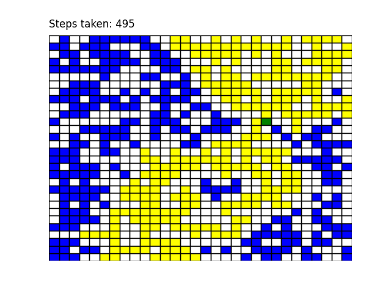

A fast percolation simulator for an arbitrarily sized 2d grid.

## Percolation Theory
Percolation theory studies how connected clusters form in a grid as random sites are occupied. 
This theory is essential for understanding phenomena like fluid flow in porous materials and the spread of diseases. 
A key focus is the **percolation threshold**: the critical point at which an infinite cluster appears, 
marking a phase transition from low to high connectivity.

### Simulations
- Traditional
    - Traditional percolation simulations are slow because they evaluate the entire lattice afresh for each probability step.
    - 
- Newman-Ziff
  - The Newman-Ziff algorithm ( *"M. E. J. Newman and R. M. Zif. A fast monte carlo algorithm for site or bond
  percolation. Phys. Rev. Lett., 85:4104, Nov 2000."*) enhances efficiency by incrementally occupying sites and updating 
  - clusters without recalculating previous results. Its advantages include:
    - Incremental Updates: 
      - Starts with an empty lattice and adds one site at a time, using previous data to avoid redundant calculations.
    - Efficient Clustering: 
      - Utilizes an advanced data structure to manage cluster updates quickly, facilitating rapid checks for percolation.
    - Statistical Efficiency: 
      - Computes properties for all probabilities in a single simulation, yielding high-precision results with fewer computations.

  - This repo provides a Python implementation of the fast Newman-Ziff algorithm that calculates the percolation threshold for 
    an arbitraruly-sized 2D grid.

### Implementation
  - Details of the implementation are described [here](simulation.md)

### Sample Results
        ...
        ...perc_value = 0.600475
        ...perc_value = 0.5849
        ...perc_value = 0.59185
        ...perc_value = 0.58535
        ...perc_value = 0.58995
        ...perc_value = 0.586175
        ...perc_value = 0.5989
        ...perc_value = 0.590425
        ...perc_value = 0.574925
        ...perc_value = 0.623675
        ...perc_value = 0.583475
        ...average p: 0.5917819999999999 with (200x200) grid, 50 iterations in 38.44 secs 
  
  

  

  

# Detailed Usage
  - For detailed setup, usage, and automated tests, see  [here](details.md)
